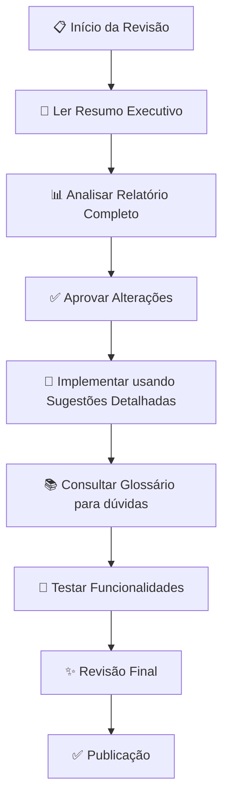

# 📚 Índice de Revisão Ortográfica - EuroEventos

## 🎯 Objetivo deste Documento

Este índice organiza **todos os arquivos de revisão ortográfica** criados para a plataforma EuroEventos, facilitando a navegação e implementação das alterações.

---

## 📁 Arquivos Disponíveis

### 1️⃣ [Relatório Completo](./REVISAO_ORTOGRAFICA_RELATORIO.md)
**📊 Detalhamento:** Extensivo  
**⏱️ Tempo de leitura:** ~20 minutos  
**🎯 Público:** Revisores, desenvolvedores seniores

**Conteúdo:**
- ✅ Resumo executivo com estatísticas
- ✅ Problemas categorizados por tipo (acentuação, formalidade, consistência)
- ✅ Detalhamento completo por arquivo com linha exata
- ✅ Justificativas técnicas e normativas
- ✅ Referências consultadas
- ✅ Próximos passos sugeridos

**Quando usar:** Para análise detalhada e tomada de decisão sobre implementação.

---

### 2️⃣ [Resumo Executivo](./REVISAO_ORTOGRAFICA_RESUMO.md)
**📊 Detalhamento:** Conciso  
**⏱️ Tempo de leitura:** ~5 minutos  
**🎯 Público:** Gestores, desenvolvedores, equipe técnica

**Conteúdo:**
- ✅ Estatísticas gerais em tabelas
- ✅ Erros críticos com exemplos em diff
- ✅ Termos a padronizar
- ✅ Checklist de implementação por fase
- ✅ Impacto esperado das alterações

**Quando usar:** Para visão rápida do que precisa ser alterado e priorização.

---

### 3️⃣ [Sugestões Detalhadas](./SUGESTOES_REVISAO_ORTOGRAFICA.md)
**📊 Detalhamento:** Prático  
**⏱️ Tempo de leitura:** ~30 minutos  
**🎯 Público:** Desenvolvedores (implementação direta)

**Conteúdo:**
- ✅ Todas as sugestões organizadas por prioridade
- ✅ Exemplos em formato diff (antes/depois)
- ✅ Justificativa para cada alteração
- ✅ Notas sobre o que NÃO alterar
- ✅ Instruções de implementação passo a passo

**Quando usar:** Durante a implementação das alterações nos arquivos HTML.

---

### 4️⃣ [Glossário de Termos](./GLOSSARIO_TERMOS.md)
**📊 Detalhamento:** Referencial  
**⏱️ Tempo de leitura:** ~15 minutos (consulta)  
**🎯 Público:** Todos os desenvolvedores, revisores futuros

**Conteúdo:**
- ✅ Termos técnicos e siglas padronizadas
- ✅ Equivalência entre termos informais e formais
- ✅ Termos específicos da plataforma EuroEventos
- ✅ Padrões de formatação (números, datas, capitalização)
- ✅ Padrões de redação (mensagens, placeholders)
- ✅ Referências normativas

**Quando usar:** Como referência durante o desenvolvimento e para manter consistência.

---

## 🗺️ Fluxo de Trabalho Recomendado

### Passo a Passo:

1. **Leitura Inicial** (5 min)
   - Comece pelo [Resumo Executivo](./REVISAO_ORTOGRAFICA_RESUMO.md)
   - Entenda o escopo e prioridade das alterações

2. **Análise Detalhada** (20 min)
   - Leia o [Relatório Completo](./REVISAO_ORTOGRAFICA_RELATORIO.md)
   - Avalie impacto de cada categoria de alteração
   - Decida quais alterações implementar primeiro

3. **Planejamento** (10 min)
   - Use o checklist do Resumo Executivo
   - Defina cronograma de implementação
   - Atribua tarefas à equipe

4. **Implementação** (variável)
   - Siga as [Sugestões Detalhadas](./SUGESTOES_REVISAO_ORTOGRAFICA.md)
   - Use o [Glossário](./GLOSSARIO_TERMOS.md) como referência
   - Altere apenas textos, mantenha funcionalidades

5. **Revisão Final** (15 min)
   - Verifique se todas as alterações críticas foram aplicadas
   - Teste funcionalidades alteradas
   - Valide com usuários da equipe acadêmica

---

## 📊 Estatísticas Consolidadas

| Categoria | Total de Itens | Arquivos Afetados | Impacto |
|---------|------------|-+--------|---------|
| 🔴 Acentuação (Crítico) | 12 | 2 | Alto - Credibilidade |
| 🟡 Formalidade Acadêmica | 28 | 6 | Médio - Profissionalismo |
| 🟡 Consistência Terminológica | 8 | 8 | Médio - Clareza |
| 🟢 Pontuação/Formatação | 7 | 2 | Baixo - Polimento |
| **TOTAL** | **47** | **8** | **Misto** |

### Arquivos Mais Afetados:

| Arquivo | Nº de Alterações | Prioridade Principal |
|---------|---+--------|----+----------|
| `event_create.html` | 22 | Média - Formalidade |
| `validation.html` | 20 | Média - Formalidade |
| `profile.html` | 18 | Média - Formalidade |
| `dashboard.html` | 15 | **Alta** - Acentuação |
| `login_register.html` | 12 | Média - Formalidade |
| `users_admin.html` | 3 | Baixa - Acentuação |
| `base.html` | 2 | Baixa - Formatação |

---

## 🎯 Prioridades de Implementação

### Fase 1 - Crítico (Imediato - 1 dia)
- [ ] Corrigir todas as palavras sem acentuação em `dashboard.html`
- [ ] Corrigir "extensao" em `users_admin.html`
- [ ] Verificar outros arquivos por erros similares

**Impacto:** Correção de erros ortográficos que comprometem credibilidade acadêmica.

---

### Fase 2 - Importante (Esta semana - 3 dias)
- [ ] Padronizar termos técnicos (check-in → registro de presença, QR Code → código QR)
- [ ] Atualizar textos para maior formalidade acadêmica
- [ ] Expandir abreviações na primeira menção (CPF, AVA, GPS, RA)
- [ ] Revisar labels de formulários

**Impacto:** Elevação do nível de formalidade e consistência terminológica.

---

### Fase 3 - Desejável (Próxima sprint - 5 dias)
- [ ] Revisar placeholders e mensagens de ajuda
- [ ] Padronizar nomenclatura de botões e ações
- [ ] Atualizar títulos de seções e modais
- [ ] Testar com usuários do público-alvo acadêmico

**Impacto:** Refinamento final e validação com usuários reais.

---

## 🔍 Como Consultar este Índice

### Para Gestores/Decisores:
1. Leia o [Resumo Executivo](./REVISAO_ORTOGRAFICA_RESUMO.md)
2. Analise estatísticas e impacto
3. Aprove ou ajuste o escopo de implementação

### Para Desenvolvedores:
1. Consulte as [Sugestões Detalhadas](./SUGESTOES_REVISAO_ORTOGRAFICA.md)
2. Use o [Glossário](./GLOSSARIO_TERMOS.md) como referência constante
3. Siga o fluxo de trabalho recomendado

### Para Revisores Futuros:
1. Leia o [Relatório Completo](./REVISAO_ORTOGRAFICA_RELATORIO.md) para entender metodologia
2. Use o [Glossário](./GLOSSARIO_TERMOS.md) como padrão
3. Atualize este índice com novas revisões

---

## 📞 Suporte e Dúvidas

### Para questões sobre:

| Tipo de Dúvida | Arquivo de Referência | Ação |
|-----|-+--------|----|
| Erros ortográficos específicos | [Relatório Completo](./REVISAO_ORTOGRAFICA_RELATORIO.md) | Verificar seção "Detalhamento por Arquivo" |
| Como implementar uma alteração | [Sugestões Detalhadas](./SUGESTOES_REVISAO_ORTOGRAFICA.md) | Seguir exemplos em diff |
| Qual termo usar em determinado contexto | [Glossário](./GLOSSARIO_TERMOS.md) | Consultar seção correspondente |
| Prioridade e cronograma | [Resumo Executivo](./REVISAO_ORTOGRAFICA_RESUMO.md) | Verificar checklist de implementação |
| Metodologia de revisão | [Relatório Completo](./REVISAO_ORTOGRAFICA_RELATORIO.md) | Ler seção "Referências Consultadas" |

---

## 📅 Histórico de Versões deste Índice

| Versão | Data | Alterações | Autor |
|-------|------|-----------|------|
| 1.0 | 14/03/2026 | Criação inicial do índice | Revisor Ortográfico |

---

## ✅ Checklist de Navegação

Antes de começar a implementação, verifique se você tem acesso a:

- [ ] Este arquivo (ÍNDICE_REVISAO.md)
- [ ] [REVISAO_ORTOGRAFICA_RELATORIO.md](./REVISAO_ORTOGRAFICA_RELATORIO.md)
- [ ] [REVISAO_ORTOGRAFICA_RESUMO.md](./REVISAO_ORTOGRAFICA_RESUMO.md)
- [ ] [SUGESTOES_REVISAO_ORTOGRAFICA.md](./SUGESTOES_REVISAO_ORTOGRAFICA.md)
- [ ] [GLOSSARIO_TERMOS.md](./GLOSSARIO_TERMOS.md)

---

**Última atualização:** 14 de março de 2026  
**Próxima revisão:** Após implementação das alterações ou quando novas revisões forem necessárias
